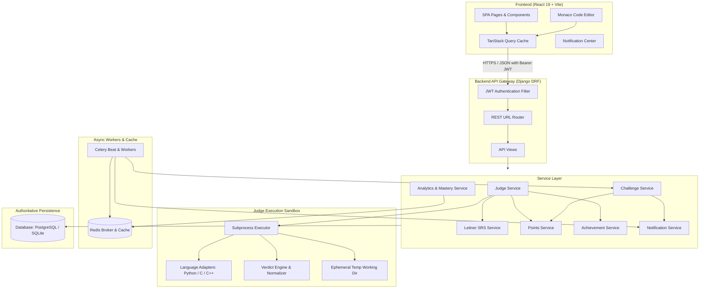
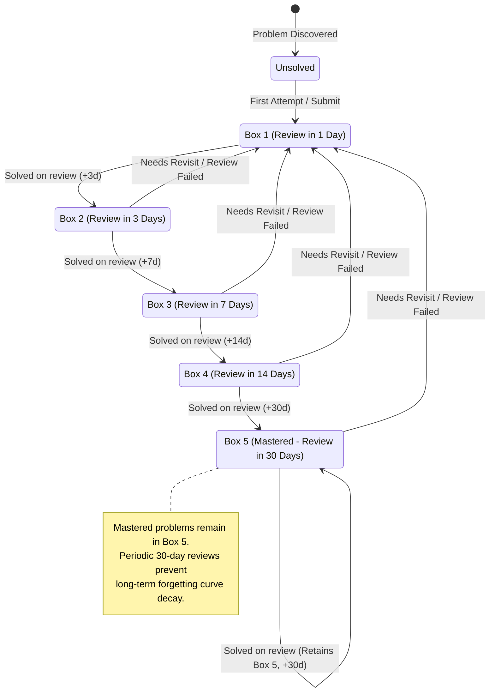

# DSA Tracker — System Architecture & End-to-End Flow Documentation

This document provides a comprehensive, architectural breakdown of the upgraded **DSA Tracker & Practice Platform**. The system blends a deterministic Spaced Repetition Engine (Leitner System), an isolated Multi-Language Online Judge, Timed Challenges, Mock Interview Simulations, Milestone Achievements, and In-App Notifications.

---

## 1. High-Level Architecture

The platform follows a decoupled client-server architecture:
- **Client (Frontend)**: React 19, Vite, TailwindCSS, Framer Motion, TanStack Query (v5), and `@monaco-editor/react`.
- **API Server (Backend)**: Django 4.2 with Django REST Framework (DRF), custom JWT authentication (`PyJWT`).
- **Asynchronous Processing**: Celery with Redis for scheduled tasks (challenge deadline enforcement, expiry notifications, review digests, weekly points reset).
- **Execution Engine (Online Judge)**: Subprocess sandboxing running in isolated temporary directories with strict timeouts, process termination, output normalization, and non-root execution guidelines.
- **Persistence**: SQLite (local development) / PostgreSQL (production) with Redis cache fallback to Django `LocMemCache`.



---

## 2. End-to-End Online Judge & Leitner Progression Pipeline

The online judge offers two distinct user flows:
1. **Run Code**: Runs user source code against arbitrary or visible input provided via stdin. It **never** updates user progress, changes Leitner boxes, or awards points.
2. **Submit Code**: Compiles and executes code against all configured test cases (both visible and hidden). If accepted, it updates the Leitner spaced repetition status, awards deterministic difficulty points, checks milestone achievements, and logs an activity event.

```mermaid
sequenceDiagram
    autonumber
    actor User as Developer / Student
    participant UI as Monaco Editor (Browser)
    participant API as Judge API Endpoint
    participant Svc as Judge Service
    participant Box as Sandbox Subprocess
    participant SRS as Leitner Engine
    participant Pts as Points & Achievements
    participant DB as Database

    User->>UI: Clicks "Submit Code" (or Ctrl+Shift+Enter)
    UI->>API: POST /api/submit/ {problem_id, language, source_code}
    API->>Svc: submit_code(user, problem_id, language, source_code)
    Svc->>DB: Fetch problem test cases (Visible + Hidden)
    
    loop For each test case
        Svc->>Box: execute(language_cfg, source_code, test_stdin)
        Box->>Box: Write to tempdir, compile (C/C++), run with timeout
        Box-->>Svc: ExecutionResult (stdout, stderr, elapsed_ms, memory_kb)
        Svc->>Svc: Normalize & compare output against expected
    end

    alt Output Mismatch or Error
        Svc->>DB: Save Submission (Verdict = WA / TLE / MLE / CE)
        Svc-->>API: Return Verdict & visible test diagnostics (Hidden I/O NEVER returned)
        API-->>UI: Display error / wrong answer banner
    else All Test Cases Pass (ACCEPTED)
        Svc->>DB: Save Submission (Verdict = ACCEPTED)
        Svc->>SRS: update_problem_progress(user, problem, status='SOLVED')
        SRS->>DB: Advance Leitner Box (1->2->3->4->5) & update next_review_date
        SRS->>DB: Update streak & daily solve stats
        Svc->>Pts: award_points(user, reason, amount) if first solve
        Pts->>DB: Increment total points & log ActivityEvent
        Svc->>Pts: check_and_unlock_achievements(user)
        Pts-->>Svc: Newly unlocked achievements
        Svc-->>API: Return ACCEPTED result + points + achievements
        API-->>UI: Display Celebration, +Points, and Achievement Badges
    end
```

---

## 3. Spaced Repetition (Leitner 5-Box SRS) State Machine

The retention engine implements a 5-box Leitner Spaced Repetition System. Every problem begins in Box 1 upon initial attempt. Consecutive successful solutions promote the problem to higher boxes with geometrically increasing review intervals. A failure or explicit "Needs Revisit" immediately resets the problem to Box 1.



---

## 4. Key Subsystems & Implementation Details

### 4.1. Secure Multi-Language Judge Engine (`tracker/judge/`)
- **`languages.py`**: Adapter registry for Python 3, C (GCC), and C++17 (G++). Java is structured for plug-and-play addition when `javac` is available.
- **`sandbox.py`**:
  - Ephemeral working directory created per execution via `tempfile.mkdtemp(prefix="dsa_judge_")`.
  - Directory contents unconditionally purged via `shutil.rmtree()` in a `finally` block.
  - Strict subprocess timeouts (default 5s for Python, 3s for compiled C/C++).
  - Hard input/output size caps (64 KB source, 1 MB stdin).
  - Cleaned execution environment forwarding only essential OS binary paths.
- **`verdict.py`**:
  - Whitespace-normalized line-by-line comparison (CRLF vs LF, trailing blanks stripped).
  - Verdict precedence: `COMPILE_ERROR` > `SYSTEM_ERROR` > `TLE` > `MLE` > `RUNTIME_ERROR` > `WRONG_ANSWER` > `ACCEPTED`.
  - **Privacy Guarantee**: `is_hidden=True` test cases execute server-side only; expected outputs and inputs are excluded from all API serialization payloads.

### 4.2. Challenges & Targeted Practice Engine (`tracker/services/challenge_service.py`)
- Allows setting target problem counts, durations (e.g. 60 min speedrun), topic/difficulty filters, or specific problem lists.
- Awards base points upon target completion, plus an **on-time completion bonus** if completed before the server deadline.
- Monitored by Celery Beat every 5 minutes (`check_challenge_deadlines`) to transition overdue challenges to `EXPIRED`.

### 4.3. Interview Simulation Mode (`tracker/models.py`, `tracker/views.py`)
- Generates mock technical rounds (30, 45, or 60 minutes) selecting problems filtered by difficulty (Easy, Medium, Hard, or Mixed) and optional company tags.
- Direct bridge to the online judge for solving during the round.
- Concluding the round awards simulation points and calculates deterministic next-step recommendations (e.g., specific weak topics or due reviews).

### 4.4. In-App Notification Center (`tracker/services/notification_service.py`)
- Deduplicated notifications for reviews due, expiring challenges, completed challenges, achievement unlocks, and streak milestones.
- Real-time polling by the frontend every 60 seconds. Supports single mark-as-read and mark-all-read.

### 4.5. Deterministic Topic Mastery & Smart Revision Queue (`tracker/services/analytics.py`)
- **Mastery Hierarchy**: 5 deterministic levels (*Beginner*, *Familiar*, *Practicing*, *Strong*, *Mastered*) computed based on solved percentage, count, and Medium/Hard problem thresholds.
- **Priority Revision Queue**: Computes an actionable preparation list prioritized by:
  1. Overdue Box 1 cards (high decay risk)
  2. Overdue higher-box cards
  3. Problems flagged as "Needs Revisit"
  4. Problems with recent failed submissions (last 7 days)
  5. Recently solved problems (reinforcement within 3 days)

---

## 5. Automated Verification & Test Coverage

All core features are covered by automated unit tests in `backend/tracker/tests/`:
- `test_judge.py`: Run code isolation, submission creation, Accepted/WA verdicts, test case privacy.
- `test_points.py`: Server-authoritative point awards, challenge bonus, streak milestone points, weekly reset.
- `test_achievements.py`: Deterministic condition checks, idempotent unlocking.
- `test_challenges.py`: Challenge creation, progress tracking, deadline finalization.
- `test_interview.py`: Mock session creation, problem solving, session completion, scoring.
- `test_submission_ownership.py`: Cross-user data isolation (users cannot access another's code).
- `test_leitner.py`: 5-box progression intervals, reset on revisit.
- `test_analytics.py`: Heatmap, timeline, streaks, and topic strength.
- `test_auth.py` & `test_email_backends.py`: JWT auth and verification.

All 63 tests execute cleanly in under 9 seconds.

---

## 6. Canonical Problem Contract & Dataset-Wide Online Judge Architecture

To scale the Online Judge across the entire problem bank (3,392 problems) without question-specific hardcoding or fabricating fake tests, the platform enforces a strict **Canonical Problem Contract**:

### 6.1. Contract Definition
A problem is marked `is_judge_ready=True` (`JUDGE_READY`) if and only if:
1. `execution_mode` is defined (`FUNCTION` or `STDIN_STDOUT`).
2. For `FUNCTION` mode: target `function_name` and `class_name` are non-empty.
3. At least one visible test case (`is_hidden=False`) and at least one hidden test case (`is_hidden=True`) exist in `TestCase`.
4. Language starter templates and execution harnesses exist for Python and C++ (or Java).

If any prerequisite is missing:
- The problem is designated `is_judge_ready=False` (`CONFIGURATION_REQUIRED`).
- `missing_configuration` is populated with an explicit array of missing requirements (e.g. `["Missing target function signature", "Missing visible test cases", "Missing hidden test cases", "Missing language starter templates (python, cpp)"]`).

### 6.2. Dataset Audit & Contract Synchronization Commands
- `python manage.py audit_problem_dataset`: Performs a full dataset audit across all 3,392 problems and outputs exact counts of judge-ready vs configuration-required problems, test coverage, and representative samples.
- `python manage.py sync_problem_contracts`: Evaluates every problem against the canonical contract and performs bulk database updates to persist readiness states.

### 6.3. Universal `[ Solve ]` Navigation Across Platforms
Every problem surface on the platform features a prominent `[ Solve ]` button with immediate routing to the Online Judge:
- **Problem Bank**: Cards and table rows have `[ Solve ]` action buttons.
- **Problem Detail Modal**: `[ Solve in Judge ]` in the modal header.
- **Today's Review**: `[ Solve in Judge ]` button next to Leitner flashcard actions.
- **Company Problems**: `[ Solve ]` in company problem tables and detail modals.
- **Study Plan**: `[ Solve in Judge ]` from study plan timeline items.
- **Challenges**: Direct solve routing from assigned challenge problems.

### 6.4. Online Judge UI Contract Awareness
- **Configured Problems (`JUDGE_READY`)**: Load canonical multi-language starter templates (Python, C++, C, Java), test cases, execution harnesses, and submission handling.
- **Unconfigured Problems (`CONFIGURATION_REQUIRED`)**: The editor displays an informative configuration notice banner, shows exact missing requirements, disables Run/Submit buttons with helpful tooltips, and provides direct links to solve on LeetCode without attempting to execute broken generic CLI fallback scripts.

