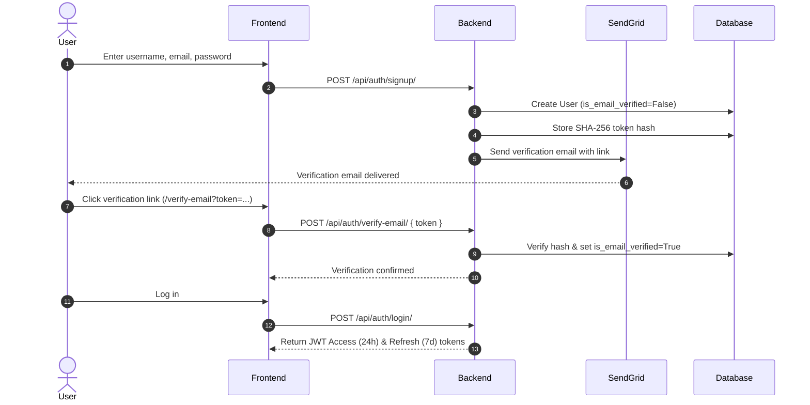
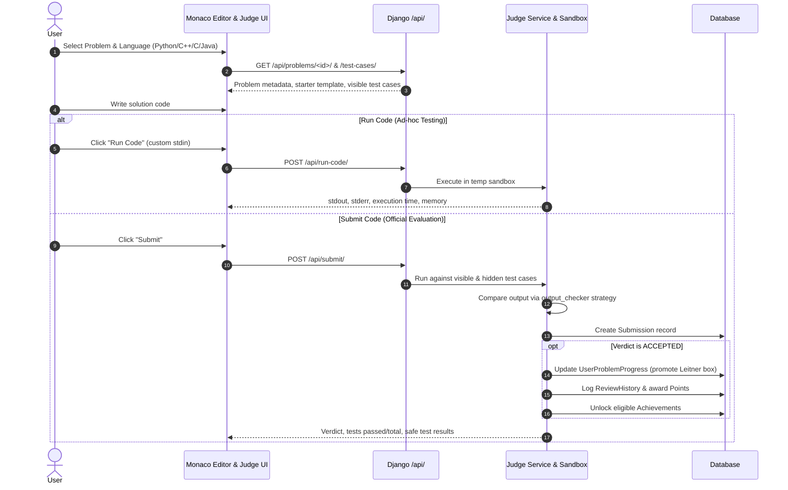
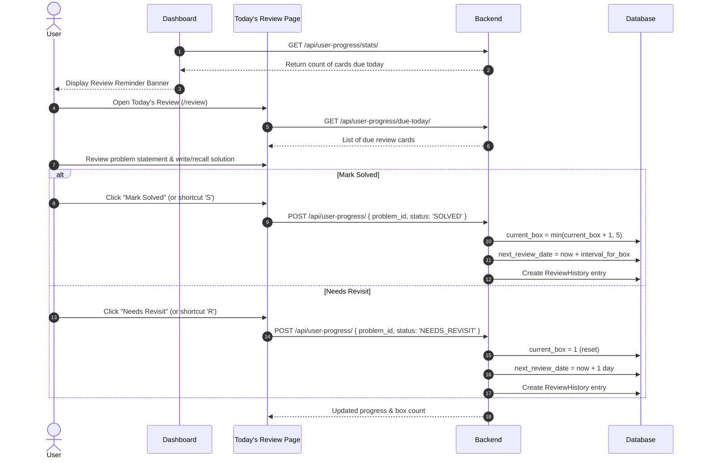
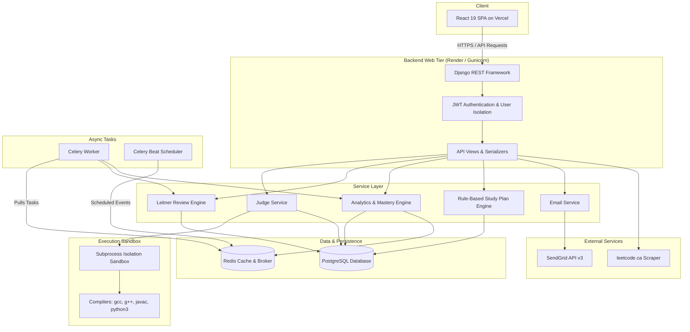

# 🧠 DSA Tracker

[](https://github.com/VaraPrasad1800/Dsa-Tracker/actions/workflows/ci.yml)

A **production-ready, full-stack Data Structures & Algorithms practice platform and interview preparation tracker**. Built to solve the core problem of technical interview preparation: retaining algorithmic patterns, identifying weak topic areas, practicing under realistic code-execution conditions, and systematically preparing for company-specific interviews using scientifically-backed spaced repetition.

DSA Tracker integrates a curated problem bank, a **complete-program Online Judge** supporting multiple compiled and interpreted languages, a **Leitner 5-box spaced repetition engine**, behavioral analytics with Redis caching, company-specific frequency tracking, customizable weak focus areas, timed mock interview simulations, and automated reminders.

---

## 📑 Table of Contents

- [Overview](#overview)
- [Key Features](#key-features)
- [User Workflows](#user-workflows)
- [Online Judge Architecture](#online-judge-architecture)
- [Learning & Review System (Leitner 5-Box)](#learning--review-system-leitner-5-box)
- [Analytics & Dashboard](#analytics--dashboard)
- [Problem Bank & Solution Scraper](#problem-bank--solution-scraper)
- [Company Tracking](#company-tracking)
- [Notification System](#notification-system)
- [Authentication & Account Management](#authentication--account-management)
- [Technology Stack](#technology-stack)
- [System Architecture](#system-architecture)
- [Project Directory Structure](#project-directory-structure)
- [Database & Data Model Overview](#database--data-model-overview)
- [API Reference](#api-reference)
- [Local Development Setup](#local-development-setup)
- [Running Tests & Builds](#running-tests--builds)
- [Deployment Architecture](#deployment-architecture)
- [Environment Configuration](#environment-configuration)
- [Current Project Status](#current-project-status)
- [Known Limitations](#known-limitations)
- [Future Direction](#future-direction)
- [Contributing & Development Notes](#contributing--development-notes)

---

## 🎯 Overview

### The Problem
Most candidates practicing DSA face common failure modes:
1. **The Forgetting Curve** — Solving a tricky graph or DP problem, only to forget the approach 3 weeks later when an interview arrives.
2. **Blind-Spot Practice** — Continuing to solve comfortable topics (e.g. Arrays/Strings) while avoiding actual weak areas (e.g. Dynamic Programming, Graphs).
3. **Passive Reading vs. Active Coding** — Reading solutions instead of writing complete, working code evaluated against strict time/memory constraints.
4. **Scattered Company Prep** — Inability to prioritize problems specifically asked by target tech companies within recent interview windows (30 days, 3 months, 6 months).

### The Solution
DSA Tracker acts as an intelligent command center:
- **Tracks every attempt** with granular audit trails, execution metrics, and code history.
- **Schedules reviews automatically** using the Leitner 5-box spaced repetition algorithm.
- **Evaluates code in an Online Judge** against visible sample test cases and hidden edge-case suites.
- **Quantifies readiness** through automated topic mastery scores, activity heatmaps, and placement readiness ratings.
- **Targets company interview loops** by aggregating company question appearances, frequencies, and acceptance rates.

---

## ✨ Key Features

### 1. Authentication & Security
- **JWT Authentication** — Stateless access tokens (24-hour lifetime) with refresh token rotation (7-day lifetime) via custom `JWTAuthentication`.
- **Email Verification** — Mandatory account verification powered by SendGrid API v3; generates single-use cryptographic tokens (SHA-256 hashed in database) with idempotent handling and safe error reporting.
- **Password Reset Flow** — Secure tokenized forgot/reset password links delivered via email.
- **Strict User Isolation** — Every progress record, submission, review card, and study plan is partitioned by user ID at both the database and query layers.
- **Instant Demo Switching** — Pre-seeded accounts (`demo_user` and `test_user`) for instant local evaluation and testing.

### 2. Curated Problem Bank & Practice
- **Comprehensive Problem Catalog** — Hundreds of curated DSA problems classified by Difficulty (Easy, Medium, Hard), Topic Tags, and Question Number.
- **Multi-Faceted Filtering & Search** — Filter simultaneously by difficulty, topic tags, company, solve status (Solved, Unsolved, Needs Revisit, Skipped), and text search.
- **Canonical Numbering** — Normalized problem numbers aligned with standard problem numbering (e.g. #1 Two Sum).
- **Bookmarks & Notes** — Personal problem bookmarking and solution notes attached to user progress records.
- **Keyboard Shortcuts** — Rapid keyboard navigation (`S` to mark solved, `R` for revisit, `?` for shortcuts modal, `Esc` to dismiss).

### 3. Complete-Program Online Judge
- **Multiple Supported Languages** — Python 3, C++ (G++ C++17), C (GCC), and Java (OpenJDK).
- **Complete-Program Contract** — Solutions execute as standard standalone programs reading from `stdin` and writing to `stdout`, matching standard algorithmic competition formats.
- **Dual Execution Modes**:
  - **Run Code** (`POST /api/run-code/`) — Quick execution against custom or sample `stdin` with instant output; does not modify user progress or create submission history.
  - **Submit Code** (`POST /api/submit/`) — Automated batch execution against all visible and hidden test cases, verdict determination, submission persistence, Leitner progress updates, and point awards.
- **Verdict Engine** — Rigorous classification: `ACCEPTED`, `WRONG_ANSWER`, `COMPILE_ERROR`, `RUNTIME_ERROR`, `TLE` (Time Limit Exceeded), `MLE` (Memory Limit Exceeded), `EXECUTION_ERROR`, and `SYSTEM_ERROR`.
- **Intelligent Output Checkers** — Problem-specific comparison strategies including normalized text, exact match, pipe-separated alternatives, floating-point tolerance ($10^{-5}$), integers, booleans, arrays, multiset equality, and JSON.
- **Secure Sandbox** — Subprocesses execute in isolated temporary directories with scrubbed environments (zero forwarded database credentials or API secrets), strict timeout enforcement, and memory monitoring.
- **Information Security** — Hidden test case inputs and expected outputs are strictly withheld from client responses; only pass/fail status and execution time are returned.
- **IDE-Grade Editor** — Monaco Code Editor with syntax highlighting, automatic indentation, starter template generation, and resizable multi-pane layout.

### 4. Spaced Repetition (Leitner 5-Box Engine)
- **Scientific Review Intervals**:
  - **Box 1**: Every 1 day (Freshly learned / Reset)
  - **Box 2**: Every 3 days (Practicing)
  - **Box 3**: Every 7 days (Building recall)
  - **Box 4**: Every 14 days (Strengthening)
  - **Box 5**: Every 30 days (Mastered)
- **Deterministic Progression Rules**:
  - Successfully solving/reviewing a problem promotes it to the next box (`current_box += 1`) and schedules the next review.
  - Marking a problem as "Needs Revisit" resets it immediately to **Box 1** for review tomorrow.
- **Distraction-Free "Today's Review"** — Dedicated flashcard review mode showing problems currently due, review progress bars, and box distribution visualizers.
- **Audit Logging** — Every box transition and revisit action is permanently logged in the `ReviewHistory` model.

### 5. Analytics & Placement Readiness
- **52-Week Annual Heatmap** — GitHub-style activity grid showing daily solve counts, cached in Redis with a 6-hour TTL and invalidated automatically on progress changes.
- **Topic Mastery Breakdown** — Visual progress bars comparing solved vs. total problems per topic tag, automatically flagging weak areas (<50% solve rate).
- **Dynamic Target Focus Areas** — Customizable focus areas on the dashboard: users can customize up to 5 focus topics or allow the system to dynamically select their lowest-mastery topics, with 1-click practice shortcuts.
- **Difficulty Distribution** — Donut chart tracking Easy, Medium, and Hard proportions.
- **Streak Tracker** — Current daily streak (🔥), all-time longest streak (🏆), and last active solve date.
- **Placement Readiness Rating** — Quantified readiness metric mapping solve volume, difficulty distribution, and topic coverage to readiness bands (Not Ready, Foundational, Interview Ready, Placement Ready).

### 6. Company Interview Tracking
- **Company Catalog** — Directory of top tech employers (Google, Meta, Amazon, Microsoft, Apple, Uber, etc.).
- **Real-Time Company Search** — In-memory client search bar coupled with backend `?search=` query filtering.
- **Recency & Frequency Filters** — View problems asked within specific hiring windows: Thirty Days, Three Months, Six Months, or All periods, with interview frequency percentages and acceptance rates.

### 7. Rule-Based Study Plan Generator
- **Deterministic Heuristic Allocation**:
  - **30% Slots**: Spaced repetition backlog (Box 1–2 cards + items flagged for revisit).
  - **40% Slots**: Weakest topics (<50% solved, sorted by lowest mastery).
  - **20% Slots**: Medium-difficulty balanced practice.
  - **10% Slots**: Hard-difficulty push, prioritized in final weeks.
- **Day-by-Day Timeline** — Generated preparation schedule with clear rationale tags ("Clear Box 1 backlog", "Weak in DP", "Hard push").
- **Adaptive Adjustments** — Starts with Easy problems if the user's current streak is zero; shifts focus as target interview dates approach.

### 8. Gamification & Challenges
- **Timed Challenges** — Create time-bounded preparation goals across categories: Count, Timed, Topic, Difficulty, Company, Deadline, and Review.
- **Server-Authoritative Points** — Point rewards for accepted solves (Easy: 10 pts, Medium: 20 pts, Hard: 30 pts), challenge completions, and streaks, with weekly leaderboards and reset tasks.
- **Milestone Achievements** — Deterministic badge unlock system (e.g. First Solve, Streak Milestones, Topic Mastery, Difficulty Milestones).

### 9. Mock Interview Simulation
- **Timed Interview Environment** — Configurable mock interview sessions (e.g. 45 minutes, 2 problems) with difficulty presets (Easy, Medium, Hard, Mixed) or target company sets.
- **Session Tracking** — Live countdown timer, score calculation, problem attempt tracking, and completion status.

### 10. Notifications & Alerts
- **Portal-Rendered Notification Dropdown** — Custom notification center escaping layout overflow containers via React Portals, featuring collision avoidance, viewport boundary clamping, and responsive positioning.
- **Automated Event Triggers** — In-app alerts for pending review digests, expiring challenges, completed challenges, achievement unlocks, and streak milestones.
- **Scheduled Digests** — Celery Beat automated daily review digests sent to user accounts.

### 11. Scraped Solution Editorials
- **Server-Side Solution Scraper** — Automatically scrapes problem statements, explanations, multi-language code implementations, and asymptotic time/space complexities from `leetcode.ca`.
- **Two-Tier Cache Strategy** — Cached in the `Solution` model with a 7-day TTL and 1-hour retry logic for temporary network errors; client requests never trigger external requests directly.

---

## 🔄 User Workflows

### Workflow 1: User Onboarding & Authentication


### Workflow 2: Problem Solving with Online Judge


### Workflow 3: Spaced Repetition Review


---

## ⚡ Online Judge Architecture

The Online Judge executes untrusted user code under strict resource constraints, evaluates correctness against test suites, and integrates results with user progress.

### 1. Complete Standalone Program Model
The platform operates on a **standard I/O complete program contract**:
- User programs read test input from standard input (`sys.stdin`, `cin`, `scanf`, `Scanner`).
- User programs output final answers to standard output (`sys.stdout`, `cout`, `printf`, `System.out.println`).
- No synthetic function wrappers, hidden driver harnesses, or reflection classes are imposed; users write clean, complete code identical to competitive programming standards.

### 2. Supported Languages & Toolchains

| Language | Identifier | Compiler / Runtime | Default Compilation Command | Timeout | Default Memory |
|:---|:---|:---|:---|:---|:---|
| **Python 3** | `python` | Python 3.10+ | *(Interpreted — no compile step)* | 5.0s | 128 MB |
| **C++** | `cpp` | G++ (GCC) | `g++ -O2 -std=c++17 -o {binary} {source}` | 3.0s | 128 MB |
| **C** | `c` | GCC | `gcc -O2 -o {binary} {source} -lm` | 3.0s | 64 MB |
| **Java** | `java` | OpenJDK (Bullseye/Bookworm) | `javac {source}`<br>*(Run: `java -Xmx256m -cp {dir} Main`)* | 5.0s | 256 MB |

### 3. Execution & Evaluation Flow
```
User Source Code
       │
       ▼
[Judge Service] ──► Validates language & checks input size limits (64KB code, 2MB stdin)
       │
       ▼
[Sandbox Isolation] ──► Creates unique temp directory (e.g. /tmp/judge_xyz)
       │
       ├─► [Compilation Phase] (C, C++, Java only)
       │         │
       │         ├─► Exit != 0 ──► Emit COMPILE_ERROR immediately
       │         └─► Exit == 0 ──► Proceed to test suite
       │
       └─► [Execution Phase] (Per test case)
                 │
                 ├─► Pipe stdin into subprocess with strict timeout & safe env
                 ├─► Capture stdout, stderr, execution time, and memory
                 │
                 ▼
          [Verdict Engine]
                 │
                 ├─► Subprocess timed out ─────────────► TLE
                 ├─► Subprocess crashed (non-zero) ─────► RUNTIME_ERROR
                 ├─► Memory limit exceeded ────────────► MLE
                 │
                 └─► Clean exit (0)
                           │
                           ▼
                    [Output Checker Strategy]
                           │
                           ├─► Match ──────► ACCEPTED
                           └─► Mismatch ───► WRONG_ANSWER
```

### 4. Output Checker Strategies
Configured via `Problem.output_checker`:
- `EXACT` — Exact character-for-character equality after trimming leading/trailing whitespace.
- `NORMALIZED` / `NORMALIZED_TEXT` — Line-by-line whitespace-insensitive comparison; normalizes CRLF/LF line endings and ignores trailing spaces.
- `ALTERNATIVES` — Pipe-separated valid outputs (e.g. `"aba|bab"`); accepts any listed alternative.
- `BOOLEAN` — Normalizes `true`/`True`/`1` and `false`/`False`/`0`.
- `INTEGER` — Compares integer numerical values regardless of formatting.
- `FLOAT_WITH_TOLERANCE` — Verifies floating-point numbers within a relative/absolute tolerance of $10^{-5}$.
- `ARRAY` — Tokenizes space/bracket/comma-separated tokens and compares sequential elements.
- `ORDER_INSENSITIVE_ARRAY` — Multiset equality; tokens must match regardless of element order.
- `JSON` — Parses strings as JSON and recursively asserts structural equality.

### 5. Verdict Precedence
When evaluating multiple test cases, the overall submission verdict is determined by strict priority:
$$\text{COMPILE\_ERROR} > \text{SYSTEM\_ERROR} > \text{EXECUTION\_ERROR} > \text{TLE} > \text{MLE} > \text{RUNTIME\_ERROR} > \text{WRONG\_ANSWER} > \text{ACCEPTED}$$

### 6. Sandbox Security Architecture
- **Fresh Temporary Directories** — Every execution takes place in a dedicated temporary folder (`tempfile.mkdtemp`), guaranteed to be deleted in a `finally` block regardless of outcome.
- **Environment Scrubbing** — Subprocesses receive an explicitly whitelisted environment (`_safe_env`): only essential system paths (`PATH`, `JAVA_HOME`, `HOME`, locale variables) are passed. Django settings, database passwords, and API credentials are completely excluded.
- **Hard Process Termination** — Subprocesses that exceed the time limit are killed immediately using process group signals (`terminate()` followed by `kill()`).
- **Dual Timeout Protection**:
  1. *Per-Test-Case Timeout*: Adjusted by difficulty and language multiplier (e.g. Python $\times 2.0$, Java $\times 1.5$ + startup buffer).
  2. *Cumulative Test Suite Ceiling*: Hard cap of 30 seconds (`MAX_CUMULATIVE_SUBMISSION_TIME_MS`) across the entire test suite to prevent Denial-of-Service.
- **Information Leak Prevention** — Hidden test cases are marked with `is_hidden=True`. The judge never outputs hidden test inputs or expected outputs in API responses; callers receive only pass/fail status and runtime metrics.

### 7. UI / Editor Features
- **Monaco Code Editor** with syntax highlighting and indentation.
- **Resizable 3-Pane Layout** (`ResizableDivider`) dividing the problem statement, code editor, and test case/results panels with drag handles and `localStorage` layout persistence.
- **Lazy Problem Loading** — Problems in the judge problem selector are fetched on demand with pagination and debounced search, avoiding heavy upfront bundle payloads.

---

## 📈 Learning & Review System (Leitner 5-Box)

The spaced repetition system is modeled after Sebastian Leitner’s learning methodology:

```
[ Unsolved Problem ]
         │
         ▼  (Solve / Pass)
    ┌─────────┐
    │  Box 1  │ ◄──────────────────────────────┐
    └────┬────┘                                │
         │ (Pass after 1 day)                   │
         ▼                                      │
    ┌─────────┐                                 │ (Fail /
    │  Box 2  │                                 │  Mark Needs Revisit
    └────┬────┘                                 │  at any box)
         │ (Pass after 3 days)                  │
         ▼                                      │
    ┌─────────┐                                 │
    │  Box 3  │ ────────────────────────────────┤
    └────┬────┘                                 │
         │ (Pass after 7 days)                  │
         ▼                                      │
    ┌─────────┐                                 │
    │  Box 4  │ ────────────────────────────────┤
    └────┬────┘                                 │
         │ (Pass after 14 days)                 │
         ▼                                      │
    ┌─────────┐                                 │
    │  Box 5  │ (Mastered - every 30 days) ─────┘
    └─────────┘
```

- **Promotion**: When a card due for review is solved or marked solved, `current_box` advances by 1 (up to Box 5), and `next_review_date` is projected forward by that box’s interval.
- **Demotion**: If marked "Needs Revisit" or failed during review, the problem resets immediately to **Box 1**, scheduling a review for tomorrow.
- **Audit History**: All transitions are written to `ReviewHistory(old_box, new_box, action, created_at)`.

---

## 📊 Analytics & Dashboard

- **Activity Heatmap**: 52-week calendar grid computing daily problem solves, cached via Redis (`get_user_heatmap`).
- **Placement Readiness Index**: Computes readiness score out of 100 based on:
  - Total solved count
  - Difficulty distribution balance (Easy / Medium / Hard)
  - Topic coverage across data structures and algorithms
  - Active streak stability
- **Topic Mastery**: Aggregates solve percentages across categories (Array, Tree, Graph, DP, Greedy, etc.).
- **Dynamic Weak Focus Areas**:
  - Automatically identifies topics where user solve rate is $<50\%$.
  - Allows users to pin up to 5 custom focus topics via `EditFocusAreasModal` (`PATCH /api/user/focus-topics/`).
  - Provides direct one-click practice links filtering the problem bank by focus topic.
- **Streaks**: Tracks current consecutive active practice days and all-time record streak.

---

## 📚 Problem Bank & Solution Scraper

- **Problem Storage**: Problems include difficulty, description, topic tags, company associations, time limits, memory limits, and sample examples.
- **Editorial Solution Scraper** (`tracker/scraper.py`):
  - Fetches problem descriptions, multi-language solutions (Python, C++, Java, C, Go, JS), and asymptotic complexities from `leetcode.ca`.
  - Cached in database model `Solution`.
  - Serves cached solutions instantly; avoids hitting external endpoints repeatedly.

---

## 🏢 Company Tracking

- **Company Explorer**: Directory of tech firms with problem counts and average acceptance rates.
- **Instant Search**: Real-time client-side name/slug search with backend query optimization (`/api/problems/companies/?search=Google`).
- **Recency Windows**: Breakdown of problem appearances:
  - Last 30 Days
  - Last 3 Months
  - Last 6 Months
  - All-Time
- Shows interview frequency percentage and historical acceptance rates.

---

## 🔔 Notification System

- **Portal-Rendered Notification Dropdown**: Uses React's `createPortal` to render the notification panel directly into `document.body`, escaping parent overflow clipping.
- **Responsive Positioning**: Calculates bounding box coordinates dynamically, clamping position between screen boundaries ($16\text{px}$ from viewport edges) and adjusting max height to prevent bottom clipping.
- **Event-Driven Alerts**: Notifies users of due reviews, expiring challenges, completed challenges, and streak milestones.
- **Management API**: Endpoints to list notifications, mark individual items as read, or mark all as read.

---

## 🔐 Authentication & Account Management

- **Endpoints**:
  - `POST /api/auth/signup/` — Registration triggering verification email.
  - `POST /api/auth/verify-email/` — Confirms email token.
  - `POST /api/auth/resend-verification/` — Issues new verification email with rate limits.
  - `POST /api/auth/login/` — Issues JWT access and refresh tokens.
  - `POST /api/auth/refresh-token/` — Refreshes access token.
  - `POST /api/auth/forgot-password/` & `/api/auth/reset-password/` — Secure tokenized password recovery.
  - `GET /api/auth/me/` — Returns authenticated user profile and available demo switch accounts.
- **Data Export**:
  - `GET /api/export/progress/?format=json|csv|markdown` — Full export of user progress, code solutions, notes, and review history.

---

## 🛠️ Technology Stack

### Frontend
- **Framework**: React 19 (`19.2.8`)
- **Build Tool**: Vite 8 (`8.2.2`)
- **Styling**: Tailwind CSS 3 (`3.4.17`)
- **Code Editor**: Monaco Editor (`@monaco-editor/react 4.7.0`)
- **State & Data Fetching**: TanStack React Query (`@tanstack/react-query 5.102.8`)
- **Routing**: React Router 7 (`react-router-dom 7.18.3`)
- **Charts**: Recharts (`3.10.1`)
- **3D Visuals**: Three.js (`three 0.186.0`, `@react-three/fiber`, `@react-three/drei`)
- **Animations**: Framer Motion (`13.2.0`)
- **Icons**: Lucide React (`1.42.0`)
- **HTTP Client**: Axios (`1.20.0`)
- **Notifications**: React Hot Toast (`2.6.0`)
- **Linter**: Oxlint (`1.79.0`)

### Backend
- **Language**: Python 3.10+
- **Web Framework**: Django 4.2 LTS (`Django>=4.2,<5.0`)
- **API Framework**: Django REST Framework (`djangorestframework>=3.14.0`)
- **Task Queue & Scheduler**: Celery (`celery>=5.3.6`) & Celery Beat
- **In-Memory Cache & Broker**: Redis (`redis>=5.0.1`) with `LocMemCache` fallback
- **Database**: PostgreSQL (`psycopg2-binary>=2.9.9`) with SQLite fallback
- **Authentication**: PyJWT (`PyJWT>=2.8.0`)
- **CORS Handling**: `django-cors-headers>=4.3.1`
- **Filtering**: `django-filter>=23.5`
- **Email Delivery**: SendGrid Python SDK (`sendgrid>=3.6.5,<7.0.0`) with console backend fallback
- **Scraper**: BeautifulSoup4 (`beautifulsoup4>=4.12.0`), `lxml>=5.0.0`, `requests>=2.31.0`
- **WSGI Server**: Gunicorn (`gunicorn>=21.2.0`)

### System & Judge Toolchains (in Docker / Production)
- **C Compiler**: GCC (`gcc`, `libc6-dev`)
- **C++ Compiler**: G++ (`g++`, `build-essential`)
- **Java Compiler/Runtime**: OpenJDK (`default-jdk-headless`)
- **Python Runtime**: Python 3.10 interpreter

---

## 🏗️ System Architecture



---

## 📁 Project Directory Structure

```
Dsa Tracker/
├── backend/                              # Django REST API backend
│   ├── core/                             # Project core configuration
│   │   ├── __init__.py
│   │   ├── celery.py                     # Celery application definition
│   │   ├── settings.py                   # Django settings, DB, Cache, Celery, CORS
│   │   ├── urls.py                       # Root URL dispatcher
│   │   └── wsgi.py                       # WSGI entrypoint for Gunicorn
│   ├── data/                             # Curated datasets & CSV dumps
│   │   └── sample_problems.csv           # Seed problem dataset
│   ├── tracker/                          # Main business application
│   │   ├── authentication.py             # Custom JWT authentication class
│   │   ├── email_backends.py             # SendGrid v3 SDK EmailBackend
│   │   ├── models.py                     # 18 core domain entities
│   │   ├── serializers.py                # DRF serializers
│   │   ├── views.py                      # 60 APIView classes
│   │   ├── urls.py                       # Tracker API route registrations
│   │   ├── tasks.py                      # Celery periodic & background tasks
│   │   ├── scraper.py                    # leetcode.ca solution scraping service
│   │   ├── scoring.py                    # Points, difficulty, and size constants
│   │   ├── judge/                        # Online Judge subsystem
│   │   │   ├── judge_config.py           # Centralized timing & resource policies
│   │   │   ├── languages.py              # Supported language configs & starter code
│   │   │   ├── executor.py               # Sandbox bridge & test execution runner
│   │   │   ├── sandbox.py                # Subprocess runner, timeout, memory limits
│   │   │   └── verdict.py                # Output checkers & verdict aggregation
│   │   ├── services/                     # Domain services
│   │   │   ├── achievement_service.py    # Milestone achievements evaluation
│   │   │   ├── analytics.py              # Heatmap, mastery, streaks, readiness
│   │   │   ├── auth_tokens.py            # SHA-256 token hashing & lifecycle
│   │   │   ├── challenge_service.py      # Timed challenge lifecycle & expiry
│   │   │   ├── email_service.py          # Verification & password reset emails
│   │   │   ├── export.py                 # JSON, CSV, Markdown progress exports
│   │   │   ├── judge_service.py          # Run code & submit execution orchestration
│   │   │   ├── leitner.py                # Leitner 5-box progression & scheduling
│   │   │   ├── notification_service.py   # In-app notification creation
│   │   │   ├── points_service.py         # User points accounting & resets
│   │   │   ├── reminders.py              # Daily review digest aggregation
│   │   │   └── study_plan.py             # Deterministic study plan generator
│   │   ├── management/commands/          # Django manage.py commands
│   │   │   ├── seed_data.py              # Seeds problems, demo users, sample stats
│   │   │   ├── import_dsa_problems.py    # Imports problems from CSV
│   │   │   ├── import_company_questions.py # Imports company question CSV data
│   │   │   ├── run_daily_tasks.py        # Runs Celery tasks synchronously
│   │   │   └── send_test_email.py        # Verifies email delivery configuration
│   │   └── tests/                        # Automated backend test suite (21 test modules)
│   ├── Dockerfile                        # Multi-stage production container with compilers
│   ├── requirements.txt                  # Python dependencies
│   └── .env.example                      # Template for backend environment variables
├── frontend/                             # React 19 + Vite frontend
│   ├── src/
│   │   ├── api/
│   │   │   └── client.js                 # Central Axios API client with auth interceptors
│   │   ├── components/
│   │   │   ├── common/                   # Shared UI (NotificationCenter, Modals, Badges)
│   │   │   ├── dashboard/                # HeroOrb, EditFocusAreasModal
│   │   │   ├── judge/                    # CodeEditor, ResizableDivider, ProblemSelector
│   │   │   ├── problems/                 # SearchBar, ProblemTable, Filters
│   │   │   ├── spaced_repetition/        # LeitnerBox visualizers, review cards
│   │   │   └── study_plan/               # Timeline cards, progress indicators
│   │   ├── pages/                        # View pages
│   │   │   ├── auth/                     # LoginPage, SignupPage, VerifyEmailPage, Reset
│   │   │   ├── AchievementsPage.jsx
│   │   │   ├── AnalyticsPage.jsx
│   │   │   ├── ChallengesPage.jsx
│   │   │   ├── CompaniesPage.jsx
│   │   │   ├── CompanyProblemsPage.jsx
│   │   │   ├── InterviewModePage.jsx
│   │   │   ├── JudgePage.jsx             # Online Judge IDE interface
│   │   │   ├── ProblemsPage.jsx          # Problem bank explorer
│   │   │   ├── SolutionPage.jsx          # Solution editorial viewer
│   │   │   ├── StudyPlanPage.jsx         # Study plan generator & timeline
│   │   │   └── TodaysReviewPage.jsx      # Spaced repetition flashcard session
│   │   ├── context/                      # AuthContext, ThemeContext
│   │   ├── App.jsx                       # Routing & layout shell
│   │   └── main.jsx                      # Vite entrypoint
│   ├── package.json                      # Frontend dependencies & scripts
│   └── vite.config.js                    # Vite configuration & dev proxy
├── docker-compose.yml                    # Full-stack Docker orchestration
├── start.ps1                             # Windows local dev launcher
└── README.md                             # Project documentation
```

---

## 🗄️ Database & Data Model Overview

| Model | Purpose | Key Relationships / Fields | User Ownership |
|:---|:---|:---|:---|
| **`User`** | Django auth user | Standard Django user model | Root identity |
| **`UserProfile`** | Extended user profile | `is_email_verified`, `email_verification_token_hash`, `focus_topics` (M2M to `Tag`), `bookmarked_problems` (M2M to `Problem`) | One-to-One with `User` |
| **`Problem`** | Algorithmic problem entity | `question_number`, `title`, `slug`, `difficulty`, `execution_mode`, `output_checker`, `time_limit_ms`, `memory_limit_mb`, `tags` (M2M), `companies` (M2M) | Shared catalog |
| **`Tag`** | Topic classification | `name`, `slug`, `category` (data_structure, algorithm, technique), `color` | Shared catalog |
| **`Company`** | Tech company entity | `name`, `slug` | Shared catalog |
| **`CompanyProblem`** | Company interview record | `company`, `problem`, `time_period` (30d, 3m, all), `frequency`, `acceptance_rate` | Shared catalog |
| **`TestCase`** | Problem test cases | `problem`, `is_hidden`, `input_text`, `expected_output`, `order`, `time_limit_seconds` | Attached to `Problem` |
| **`LanguageTemplate`** | Starter & harness code | `problem`, `language`, `starter_code`, `harness_code` | Attached to `Problem` |
| **`Solution`** | Scraped cached solutions | `problem`, `code`, `code_by_language`, `explanation`, `time_complexity`, `space_complexity`, `last_fetched_at` | Attached to `Problem` |
| **`UserProblemProgress`** | Solved state & review tracking | `user`, `problem`, `status` (UNSOLVED, SOLVED, NEEDS_REVISIT, SKIPPED), `current_box` (1–5), `next_review_date`, `times_solved`, `notes`, `code_solution` | Owned by `User` |
| **`ReviewHistory`** | Audit log of Leitner transitions | `progress` (FK to `UserProblemProgress`), `old_box`, `new_box`, `action`, `created_at` | Owned via progress |
| **`Submission`** | Online Judge submission record | `user`, `problem`, `language`, `source_code`, `verdict`, `tests_passed`, `tests_total`, `execution_time_ms`, `memory_kb`, `compile_error` | Owned by `User` |
| **`DailyStat`** | Daily activity aggregation | `user`, `date`, `problems_solved`, `problems_attempted`, `total_time_minutes`, `by_topic` | Owned by `User` |
| **`UserStreak`** | Streak metrics | `user`, `current_streak`, `longest_streak`, `last_solved_date` | One-to-One with `User` |
| **`StudyPlan`** | Generated study plan | `user`, `target_date`, `problems_per_day`, `is_active` | Owned by `User` |
| **`StudyPlanDay`** | Day allocation in study plan | `plan`, `date`, `problems` (M2M), `focus_topic`, `difficulty_target`, `reason` | Owned via plan |
| **`Challenge`** | Timed practice challenge | `user`, `title`, `template`, `start_time`, `end_time`, `status`, `points`, `completed_count` | Owned by `User` |
| **`ChallengeProblem`**| Problem within challenge | `challenge`, `problem`, `completed`, `completed_at` | Owned via challenge |
| **`Achievement`** | Milestone definition | `code`, `name`, `description`, `icon`, `points`, requirements | Shared catalog |
| **`UserAchievement`** | Unlocked milestone record | `user`, `achievement`, `unlocked_at` | Owned by `User` |
| **`Notification`** | In-app notification | `user`, `type`, `title`, `body`, `is_read`, `action_url`, `created_at` | Owned by `User` |
| **`InterviewSession`** | Mock interview session | `user`, `duration_minutes`, `difficulty`, `company`, `status`, `score`, `started_at` | Owned by `User` |
| **`InterviewProblem`** | Problem in mock interview | `session`, `problem`, `solved`, `attempts`, `submission` | Owned via session |
| **`DSAPattern`** | Common algorithm pattern | `name`, `slug`, `description`, `problems` (M2M) | Shared catalog |
| **`UserPoints`** | User gamification scores | `user`, `total`, `weekly`, `challenge_points`, `streak_points` | One-to-One with `User` |
| **`ActivityEvent`** | Audit event stream | `user`, `event_type`, `problem`, `metadata`, `created_at` | Owned by `User` |

---

## 📡 API Reference

All endpoints are registered under `/api/`. Authentication is performed via standard HTTP header:
`Authorization: Bearer <jwt_access_token>`.

### Authentication & Account
| Method | Endpoint | Description |
|:---|:---|:---|
| `POST` | `/api/auth/signup/` | Register user account and trigger verification email |
| `POST` | `/api/auth/verify-email/` | Verify email address via secure SHA-256 token |
| `POST` | `/api/auth/resend-verification/` | Resend email verification link |
| `POST` | `/api/auth/login/` | Authenticate and obtain JWT access & refresh tokens |
| `POST` | `/api/auth/refresh-token/` | Refresh an expired access token |
| `POST` | `/api/auth/forgot-password/` | Request password reset email |
| `POST` | `/api/auth/reset-password/` | Submit new password with reset token |
| `GET` | `/api/auth/me/` | Fetch current user profile, focus topics, and available demo switch accounts |

### Problems & Practice
| Method | Endpoint | Description |
|:---|:---|:---|
| `GET` | `/api/problems/` | List problems with filters (`difficulty`, `topic`, `company`, `status`, `search`) |
| `GET` | `/api/problems/<uuid:pk>/` | Retrieve problem detail with requesting user's progress |
| `GET` | `/api/problems/<uuid:pk>/solution/` | Retrieve scraped solution, code, and time/space complexity |
| `GET` | `/api/problems/tags/` | List all topic tags with problem counts |
| `GET` | `/api/problems/companies/` | List companies with problem counts; supports `?search=` filter |
| `GET` | `/api/problems/by-company/<str:company_id>/` | Retrieve problems asked by a specific company |
| `GET` | `/api/problems/practice/` | Retrieve targeted problems for specific topic practice |
| `GET` | `/api/user/focus-topics/` | Get user's custom focus topics |
| `PATCH` | `/api/user/focus-topics/` | Update user's custom focus topics (up to 5 tags) |

### Online Judge
| Method | Endpoint | Description |
|:---|:---|:---|
| `POST` | `/api/run-code/` | Execute code against ad-hoc `stdin` (no DB saves, no progress updates) |
| `POST` | `/api/submit/` | Submit code for evaluation against all test cases, persist submission, update Leitner |
| `GET` | `/api/languages/` | List supported judge languages with display names and default templates |
| `GET` | `/api/problems/<uuid:pk>/language-template/?language=...` | Retrieve starter code template for a problem |
| `GET` | `/api/problems/<uuid:pk>/test-cases/` | Retrieve visible sample test cases for a problem |
| `GET` | `/api/problems/<uuid:pk>/submissions/` | Retrieve user's previous submission history for a problem |
| `GET` | `/api/submissions/<uuid:pk>/` | Retrieve detail of a specific submission (including source code and verdicts) |

### User Progress & Spaced Repetition
| Method | Endpoint | Description |
|:---|:---|:---|
| `POST` | `/api/user-progress/` | Update progress (`status`, `notes`, `code_solution`, `code_language`) |
| `GET` | `/api/user-progress/stats/` | Overview stats (solved count, streak, due count, weak topics) |
| `GET` | `/api/user-progress/due-today/` | Fetch problems currently due for review under Leitner schedule |
| `GET` | `/api/user-progress/<uuid:pk>/` | Detail of a user's progress on a problem |
| `GET` | `/api/user-progress/<uuid:pk>/history/` | Audit history of Leitner box transitions for a problem |
| `GET` | `/api/spaced-repetition/stats/` | Distribution of problems across Boxes 1 through 5 |

### Analytics & Mastery
| Method | Endpoint | Description |
|:---|:---|:---|
| `GET` | `/api/analytics/dashboard/` | Full dashboard analytics payload (readiness, stats, weak areas) |
| `GET` | `/api/analytics/heatmap/` | 52-week annual activity heatmap (cached in Redis) |
| `GET` | `/api/analytics/topic-breakdown/` | Mastery percentage and solve counts per topic |
| `GET` | `/api/analytics/streaks/` | Current streak, longest streak, last active date |
| `GET` | `/api/analytics/difficulty-breakdown/` | Distribution across Easy, Medium, and Hard problems |
| `GET` | `/api/analytics/timeline/` | Solved vs. attempted activity timeline over time |
| `GET` | `/api/analytics/mastery/` | Granular topic mastery scores |
| `GET` | `/api/analytics/revision-queue/` | Prioritized revision queue of at-risk problems |
| `GET` | `/api/analytics/company-track/<str:company_slug>/` | Company-specific preparation track statistics |

### Reminders & Study Plans
| Method | Endpoint | Description |
|:---|:---|:---|
| `GET` | `/api/reminders/digest/` | Aggregated daily review digest |
| `POST` | `/api/study-plans/generate/` | Generate deterministic plan (`target_date`, `problems_per_day`) |
| `GET` | `/api/study-plans/active/` | Retrieve currently active study plan and day breakdown |
| `GET` | `/api/study-plans/<uuid:pk>/` | Retrieve specific study plan details |
| `POST` | `/api/study-plans/<uuid:pk>/deactivate/` | Deactivate a study plan |
| `GET` | `/api/study-plans/<uuid:pk>/progress/` | Completion metrics and pace indicator for plan |

### Challenges, Achievements & Gamification
| Method | Endpoint | Description |
|:---|:---|:---|
| `GET` | `/api/challenges/` | List user's active, completed, and expired challenges |
| `POST` | `/api/challenges/` | Create a new timed challenge |
| `GET` | `/api/challenges/<uuid:pk>/` | Retrieve challenge details and assigned problems |
| `POST` | `/api/challenges/<uuid:pk>/complete/` | Finalize and verify challenge completion |
| `GET` | `/api/achievements/` | List all milestones with user's unlocked status |
| `GET` | `/api/points/` | Current user point totals (total, weekly, streak, challenge) |

### Mock Interview Simulations
| Method | Endpoint | Description |
|:---|:---|:---|
| `GET` | `/api/interview-sessions/` | List past and active interview simulation sessions |
| `POST` | `/api/interview-sessions/` | Start a new timed mock interview session |
| `GET` | `/api/interview-sessions/<uuid:pk>/` | Get status and problems for an interview session |
| `POST` | `/api/interview-sessions/<uuid:pk>/end/` | Terminate an interview session and compute final score |
| `POST` | `/api/interview-sessions/<uuid:session_pk>/problems/<uuid:problem_pk>/solve/` | Record problem solve inside interview session |

### Notifications, Bookmarks & Export
| Method | Endpoint | Description |
|:---|:---|:---|
| `GET` | `/api/notifications/` | List notifications for authenticated user |
| `PATCH` | `/api/notifications/<uuid:pk>/read/` | Mark individual notification as read |
| `POST` | `/api/notifications/read-all/` | Mark all notifications as read |
| `POST` | `/api/bookmarks/toggle/` | Bookmark or unbookmark a problem |
| `GET` | `/api/bookmarks/` | List all bookmarked problems |
| `GET` | `/api/export/progress/` | Export user data (`?format=json`, `csv`, or `markdown`) |
| `GET` | `/api/patterns/` | List common DSA problem-solving patterns |

---

## 💻 Local Development Setup

### Prerequisites
- **Python 3.10+** and `pip`
- **Node.js 18+** and `npm`
- **Git**
- *Optional for full Online Judge local execution*: `gcc`, `g++`, OpenJDK (`javac`, `java`)
- *Optional infrastructure*: PostgreSQL and Redis (the app falls back automatically to SQLite and in-memory cache if unconfigured)

### 1. Backend Setup

```bash
# Clone repository
git clone https://github.com/VaraPrasad1800/Dsa-Tracker.git
cd "Dsa-Tracker/backend"

# Create and activate Python virtual environment
python -m venv venv

# Windows (PowerShell):
.\venv\Scripts\Activate.ps1
# Linux / macOS:
# source venv/bin/activate

# Install dependencies
pip install -r requirements.txt

# Run migrations (creates SQLite db.sqlite3 by default)
python manage.py migrate

# Seed database (~160 problems, demo users, sample review history)
python manage.py seed_data

# Start backend server on port 8000
python manage.py runserver 8000
```

### 2. Frontend Setup

```bash
# In a new terminal, navigate to frontend
cd "Dsa-Tracker/frontend"

# Install dependencies
npm install

# Start Vite dev server (proxies /api to http://localhost:8000)
npm run dev
```

Visit **`http://localhost:5173`** in your browser.

### 3. Windows One-Click Dev Launcher
Run `start.ps1` from the project root:
```powershell
.\start.ps1
```
This launches the backend on `:8001` and frontend on `:5173` with proxy routing preconfigured.

### 4. Demo Login Credentials
Seeded by `python manage.py seed_data`:
- **`demo_user`** / `password123` — Pre-loaded with 35 solved problems, reviews across Boxes 1–5, 60 days of activity stats, active study plan, and streak.
- **`test_user`** / `password123` — Clean test account.
- *Quick-switch buttons on the login page allow 1-click authentication without typing credentials.*

---

## 🐳 Docker Orchestration

Run the complete production-like stack locally with Docker Compose:

```bash
docker-compose up --build
```

Services initialized:
- `db` — PostgreSQL 15 (`localhost:5432`)
- `redis` — Redis 7 (`localhost:6379`)
- `backend` — Django application with Gunicorn/runserver and all compiler toolchains (`localhost:8000`)
- `celery_worker` — Background task worker
- `celery_beat` — Task scheduler for digests and challenge checks
- `frontend` — Production React build served via Nginx (`localhost:3000`)

---

## 🧪 Running Tests & Builds

### Backend Unit & Integration Tests
```bash
cd backend
python manage.py test tracker
```

Run specific test modules:
```bash
# Online Judge test suite
python manage.py test tracker.tests.test_judge

# Authentication & email verification tests
python manage.py test tracker.tests.test_auth tracker.tests.test_email_backends

# Spaced repetition & Leitner engine tests
python manage.py test tracker.tests.test_leitner

# Problem bank & search tests
python manage.py test tracker.tests.test_problems
```

### Frontend Build & Lint
```bash
cd frontend

# Verify production bundle build
npm run build

# Run Oxlint
npm run lint
```

---

## 🚀 Deployment Architecture

The application is deployed across separate infrastructure services:

```
[Users / Clients]
       │
       ├─────────────────────────────────────────┐
       ▼ (HTTPS)                                 ▼ (HTTPS API)
[Vercel Global CDN]                  [Render Web Service (Docker)]
  • React 19 SPA Build                 • Python 3.10 + Gunicorn
  • Vite production bundle             • Compilers: gcc, g++, default-jdk
  • Instant static edge routing        • Django REST Framework API
                                                 │
                                                 ├─► [Render PostgreSQL] (Persistent DB)
                                                 ├─► [Render Redis] (Cache & Broker)
                                                 └─► [SendGrid API v3] (Email Delivery)
```

- **Frontend**: Hosted on **Vercel** (`https://dsa-tracker-five-blue.vercel.app`), pulling directly from the `main` branch.
- **Backend API**: Hosted on **Render** (`https://dsa-tracker-4ghs.onrender.com`), running a Docker image built from `backend/Dockerfile` with explicit compiler packages (`gcc`, `g++`, `default-jdk-headless`, `libc6-dev`).
- **Database**: Managed PostgreSQL instance on Render.
- **Caching**: Managed Redis instance on Render.
- **Email**: SendGrid transactional email backend for signup verifications and password resets.

---

## ⚙️ Environment Configuration

Set these variables in `backend/.env` (or Render service environment settings):

| Variable Name | Required in Prod | Default / Dev Fallback | Purpose |
|:---|:---:|:---|:---|
| `DEBUG` | Yes | `True` | Django debug mode; must be `False` in production |
| `DJANGO_SECRET_KEY` | Yes | Local insecure key | Cryptographic signing secret |
| `POSTGRES_DB` | No | *(Empty)* | PostgreSQL database name; fallback to SQLite if empty |
| `POSTGRES_USER` | No | *(Empty)* | PostgreSQL user |
| `POSTGRES_PASSWORD` | No | *(Empty)* | PostgreSQL password |
| `POSTGRES_HOST` | No | *(Empty)* | PostgreSQL host address |
| `POSTGRES_PORT` | No | `5432` | PostgreSQL port |
| `REDIS_URL` | No | *(Empty)* | Redis connection string; fallback to `LocMemCache` if empty |
| `CELERY_BROKER_URL` | No | `redis://localhost:6379/0` | Celery broker URL |
| `CELERY_RESULT_BACKEND` | No | `redis://localhost:6379/0` | Celery result backend URL |
| `CELERY_ALWAYS_EAGER` | No | `False` | Executes Celery tasks synchronously when `True` |
| `CORS_ALLOWED_ORIGINS` | Yes | *(Empty / Allow all)* | Comma-separated list of allowed frontend origins (e.g. `https://dsa-tracker-five-blue.vercel.app`) |
| `FRONTEND_URL` | Yes | `http://localhost:5173` | Base URL used to construct verification and password reset links |
| `SENDGRID_API_KEY` | Yes | *(Empty)* | SendGrid API key; fallback to console backend in dev when `DEBUG=True` |
| `DEFAULT_FROM_EMAIL` | No | `DSA Tracker <no-reply@dsatracker.app>` | Sender email address for outgoing system emails |
| `JWT_SECRET_KEY` | No | Value of `DJANGO_SECRET_KEY` | Secret key used for signing JWT tokens |
| `JWT_EXPIRATION_HOURS` | No | `24` | Lifetime of JWT access token |
| `JWT_REFRESH_EXPIRATION_HOURS` | No | `168` | Lifetime of JWT refresh token (7 days) |
| `EMAIL_VERIFICATION_EXPIRY_HOURS`| No | `24` | Expiry duration for email verification tokens |
| `PASSWORD_RESET_EXPIRY_HOURS` | No | `1` | Expiry duration for password reset tokens |

---

## 📌 Current Project Status

### ✅ Implemented & Deployed
- [x] **Full JWT Authentication & Revocation** — Token rotation, `RefreshToken` database verification, unique UUID `jti` claims, 1-hour access token TTL, and single-use email verification/password reset with SendGrid v3 SDK integration.
- [x] **Asynchronous Online Judge** — Celery background queue execution (`run_submission_task`), `202 Accepted` response pattern, polling status endpoint (`/api/submissions/<id>/status/`), and animated evaluation feedback in UI.
- [x] **Judge Endpoint Rate Limiting & Concurrency Guards** — Dedicated throttles for `RunCodeView` (10/min) and `SubmitCodeView` (5/min), global rate limiting (120/min), and `409 Conflict` prevention against duplicate active submissions.
- [x] **Single-Compilation Batch Execution Pipeline** — `ExecutionSession` architecture compiling C/C++/Java source code once per multi-test session, achieving >25x speedup and sub-second evaluation.
- [x] **Problem Bank & Fast Search** — Multi-attribute filtering (Difficulty, Tag, Company, Status, Search) and lightweight `/api/problems/search/` endpoint with 250ms debouncing.
- [x] **Resizable 3-Pane Code Editor** — Monaco Editor with persistent split layout settings, theme toggles, and language templates.
- [x] **Spaced Repetition (Leitner 5-Box)** — Automated scheduling, transition history, and "Today's Review" distraction-free flashcard interface.
- [x] **Analytics & Behavioral Dashboard** — 52-week activity heatmap with Redis caching (6h TTL), topic mastery breakdown, and streaks.
- [x] **Weak Focus Areas** — Dynamic modal editor (up to 5 tags) and targeted practice routing based on accuracy heuristics.
- [x] **Company Question Catalog** — Frequency tracking with real-time in-memory search and backend query filtering.
- [x] **Viewport-Aware Notifications** — Screen-collision avoidance, portal rendering, and read status management.
- [x] **Study Plan Generator** — Rule-based deterministic engine with timeline cards and heuristic reasoning.
- [x] **Automated CI/CD Pipeline** — GitHub Actions workflow testing PostgreSQL 15, Redis 7, flake8, manage.py test, npm test (Vitest), and production build.
- [x] **Interactive API Documentation** — OpenAPI 3.0 schema generation, Swagger UI (`/api/docs/`), and Redoc (`/api/redoc/`) via `drf-spectacular`.
- [x] **Frontend Automated Test Suite** — Vitest + React Testing Library + JSDOM verifying authentication flows, Leitner progression, and judge evaluation.
- [x] **Observability & Request Correlation** — Sentry integration (backend & frontend) and `RequestIDMiddleware` attaching UUID4 `X-Request-ID` headers to all responses and log records.
- [x] **Production Security Hardening** — HSTS preload (1 year), SSL redirection, secure session/CSRF cookies, XSS filtering, content-type nosniff, and frame deny headers.
- [x] **Production Deployment** — Vercel (Frontend SPA) and Render (Backend Docker with compiler toolchains, PostgreSQL, and Redis).

### ⚠️ Known Limitations
- **Subprocess Isolation in Non-Docker Environments** — When running locally outside of Docker, sandbox security relies on temporary directory isolation and environment scrubbing; OS-level network isolation is only enforced when deployed in Docker/containerized environments.
- **Memory Limiting on Windows** — Posix `setrlimit` is unavailable on Windows hosts; memory limit enforcement in Windows local development falls back to post-run sampling via `psutil`.

---

## 🧭 Future Direction

Identified architectural milestones within the existing project roadmap:
1. **Persistent Judge Execution Workers** — Completing the single-compilation judge session architecture to reuse compiled binaries across all test cases.
2. **Additional Judge Languages** — Expanding compiler configurations in `tracker/judge/languages.py` to support Go and JavaScript (Node.js).
3. **Automated Problem Contract Hydration** — Expanding background hydration tasks to parse and verify test suites for newly imported problems automatically.

---

## 👥 Contributing & Development Notes

1. **Do Not Break User Isolation** — Any new query or endpoint dealing with user progress, submissions, review cards, or notifications must filter strictly by `request.user`.
2. **Zero Leaks in Judge Responses** — Never return `input_text` or `expected_output` of hidden test cases (`is_hidden=True`) to the frontend in API responses.
3. **Idempotent Migrations & Commands** — All management commands (`seed_data`, `prepare_judge_data`, `import_dsa_problems`) must be safely re-runnable without creating duplicate records.
4. **Clean Builds Before Committing** — Always run `python manage.py test tracker` and `npm run build` in `frontend` to guarantee no broken imports or build errors before pushing.

---

## 📄 License & Acknowledgements

- Built for personal, educational, and technical interview preparation.
- Problem statements, company interview frequency data, and solution explanations belong to their respective copyright holders. Editorial code and explanations sourced server-side from [leetcode.ca](https://leetcode.ca).